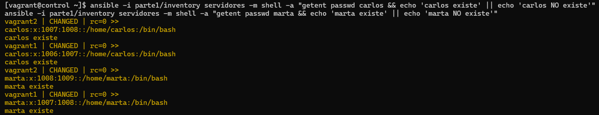
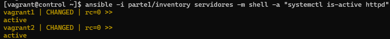
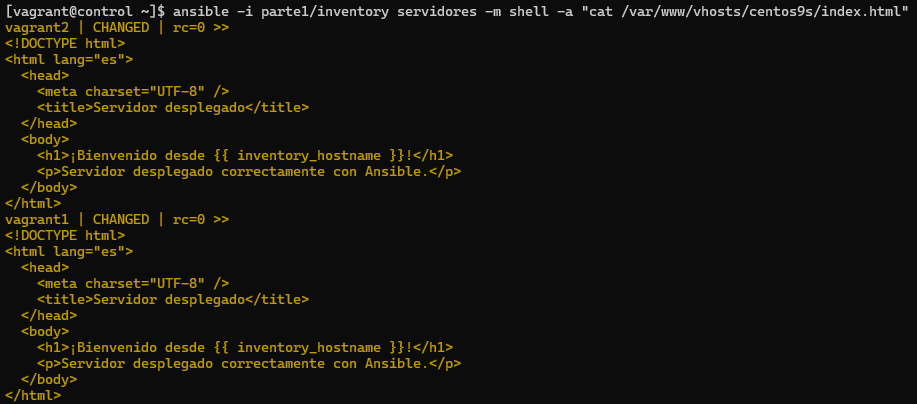
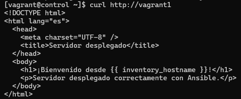

# Práctica Final de Ansible

Este proyecto consiste en una práctica dividida en dos partes, cuyo objetivo es aplicar conocimientos avanzados de Ansible para la gestión de usuarios y el despliegue automatizado de un servidor web.

## Requisitos
- Ansible
- Vagrant
- VirtualBox
- Git

## Estructura del Proyecto

```
.
├── parte1/
│   ├── ansible.cfg
│   ├── inventory
│   ├── users.yml
│   ├── remove_users.yml
│   └── verify_users.yml
└── parte2/
    ├── ansible.cfg
    ├── dev_deploy.yml
    ├── get_web_content.yml
    ├── site.yml
    ├── files/
    │   └── index.html
    └── templates/
        └── vhost.conf.j2

```

## ✍️ Parte I - Gestión de usuarios y condiciones

### 1. Crear usuarios y paquetes condicionales
- Playbook: users.yml
- Acciones:
    - Crea los usuarios carlos y marta en los hosts del grupo servidores.
    - Instala los paquetes memcached y mariadb-server (mediante una variable packages).
    - Instala redis solo si el sistema tiene más de 20MB de memoria swap.
```bash
ansible-playbook -i parte1/inventory parte1/users.yml
```
### 2. Verificación de usuarios creados
- Playbook: verify_users.yml
- Acciones: 
    - Verifica si los usuarios existen y se ejecuta en modo "--check" para validación sin cambios.
```bash
ansible-playbook -i parte1/inventory parte1/verify_users.yml --check
```
### 3. Eliminar usuarios (opcional)
- Playbook: remove_users.yml
- Acciones: 
    - Elimina los usuarios creados para restablecer el sistema.
```bash
ansible-playbook -i parte1/inventory parte1/remove_users.yml
```
### Consideraciones
- El inventario `inventory` define el grupo `[servidores]` con `vagrant1` y `vagrant2`.
- El `verify_users.yml` utiliza `getent` para comprobar la existencia de usuarios.
- La variable `ansible_facts.ansible_swaptotal_mb` se valida con `gather_facts: true` activo.

## ✍️ Parte II - Despliegue web automatizado

### 1. Desplegar servidor web Apache
- Playbook: dev_deploy.yml
- Acciones:
    - Instala Apache (httpd).
    - Habilita e inicia el servicio.
    - Copia el template vhost.conf.j2 en /etc/httpd/conf.d/vhost.conf.
    - Crea el directorio /var/www/vhosts/<hostname>/.
    - Copia index.html dentro del vhost.
    - Habilita los servicios HTTP y HTTPS en el firewall.
```bash
cd parte2 # Esto en el caso de no estar en la propia carpeta
ansible-playbook dev_deploy.yml
```

### 2. Validar despliegue web
- Playbook: get_web_content.yml
- Acciones:
    - Recupera contenido desde http://vagrant1.
    - Si falla, guarda el resultado en error.log.
```bash
cd parte2 # Esto en el caso de no estar en la propia carpeta
ansible-playbook get_web_content.yml
```

### 3. Ejecución completa del proyecto
- Playbook: site.yml
- Acciones:
    - Importa/agrupa dev_deploy.yml y get_web_content.yml.
```bash
cd parte2 # Esto en el caso de no estar en la propia carpeta
ansible-playbook site.yml
```

### 🔍 Comprobaciones realizadas
Verificación de usuarios:
```bash
ansible -i parte1/inventory servidores -m shell -a "getent passwd carlos && echo 'carlos existe' || echo 'carlos NO existe'"
ansible -i parte1/inventory servidores -m shell -a "getent passwd marta && echo 'marta existe' || echo 'marta NO existe'"
```


Estado del servicio Apache:
```bash
ansible -i parte1/inventory servidores -m shell -a "systemctl is-active httpd"
```


Contenido web:
```bash
ansible -i parte1/inventory servidores -m shell -a "cat /var/www/vhosts/centos9s/index.html"
```


Confirmar que servicio funcione:
```bash
 curl http://vagrant1
```

